# РЕЦЕНЗИЯ

(Оставляется пустой для заполнения преподавателем)

---
**Студент:** ____________________
**Группа:** ____________________
**Тема:** Проектирование и моделирование информационно-вычислительной сети предприятия общественного питания.

**Оценка:** ____________________
**Дата:** ____________________
**Подпись:** ____________________

# ОГЛАВЛЕНИЕ 
 
 1. СПИСОК ОБОЗНАЧЕНИЙ И ОСНОВНЫЕ ОПРЕДЕЛЕНИЯ 
 2. ЗАДАНИЕ НА ПРОЕКТИРОВАНИЕ 
 3. ВВЕДЕНИЕ И АНАЛИЗ ЗАДАНИЯ 
 4. ПРОЕКТИРОВАНИЕ И МОДЕЛИРОВАНИЕ СЕТИ 
    4.1. Техническое обоснование архитектуры 
    4.2. Выбор программного обеспечения и сервисов 
    4.3. Подробная схема сети 
    4.4. Агрегированная схема сети 
    4.5. Настройка параметров моделирования 
    4.6. Информационная топология 
 5. АНАЛИЗ РЕЗУЛЬТАТОВ МОДЕЛИРОВАНИЯ 
    5.0. Отчет по событиям моделирования
    5.1. Сценарий A – Базовый режим (Base) 
       5.1.1. Цели и конфигурация сценария
       5.1.2. Результаты моделирования и анализ
       5.1.3. Верификация и доказательства
       5.1.4. Вывод по сценарию A
    5.2. Сценарий B – Работа с резервом (Reserve) 
       5.2.1. Цели и конфигурация сценария
       5.2.2. Результаты моделирования и анализ
       5.2.3. Верификация и доказательства
       5.2.4. Вывод по сценарию B
    5.3. Сценарий C – Авария (Failure) 
       5.3.1. Цели и конфигурация сценария
       5.3.2. Результаты моделирования и анализ
       5.3.3. Верификация и доказательства
       5.3.4. Вывод по сценарию C
    5.4. Сценарий D – Масштабирование (Scale Up) 
       5.4.1. Цели и конфигурация сценария
       5.4.2. Результаты моделирования и анализ
       5.4.3. Верификация и доказательства
       5.4.4. Вывод по сценарию D
    5.5. Сравнительный анализ и выводы по моделированию
       5.5.1. Реализация требований безопасности и надежности
       5.5.2. Ключевые выводы и аналитический вывод
 6. ТЕОРЕТИКО-РАСЧЕТНАЯ ЧАСТЬ 
    6.1. Расчет нагрузки на серверный сегмент
    6.2. Нагрузка на магистральный канал (WAN)
    6.3. Расчет загрузки резервного канала
    6.4. Теоретическая оценка времени сходимости OSPF
    6.5. Расчет максимальной пропускной способности при масштабировании
    6.6. Коэффициент использования каналов
    6.7. Итоговый аналитический вывод по главе
 7. ТРЕБОВАНИЯ К ОБОРУДОВАНИЮ ПО УРОВНЯМ ИЕРАРХИИ 
 8. СПЕЦИФИКАЦИЯ ОБОРУДОВАНИЯ И МАТЕРИАЛОВ 
    8.1. Активное сетевое оборудование
    8.2. Оценка стоимости активного оборудования
    8.3. Пассивное оборудование и кабели
    8.4. Программное обеспечение
    8.5. Обоснование выбора
 9. ЗАКЛЮЧЕНИЕ 
 10. СПИСОК ИСПОЛЬЗОВАННЫХ ИСТОЧНИКОВ 
 ПРИЛОЖЕНИЯ 

## 1. СПИСОК ОБОЗНАЧЕНИЙ И ОСНОВНЫЕ ОПРЕДЕЛЕНИЯ

В таблице 1.1 приведены основные сокращения и определения, используемые в рамках данного курсового проекта.

**Таблица 1.1 — Список обозначений и основных определений**

| Обозначение | Определение |
|:---|:---|
| **ЛВС** | Локальная вычислительная сеть — коммуникационная система, объединяющая оборудование на ограниченной территории. |
| **OSPF** | Open Shortest Path First — протокол динамической маршрутизации на основе состояния каналов. |
| **RTT** | Round-Trip Time — время, затраченное на отправку сигнала и получение подтверждения. |
| **Отказоустойчивость** | Свойство системы сохранять работоспособность после отказа одного или нескольких компонентов. |
| **HQ** | Headquarters — центральный офис или главный узел сети. |
| **PPP** | Point-to-Point Protocol — протокол канального уровня для связи между двумя узлами. |
| **INET Framework** | Библиотека моделей для симулятора OMNeT++, реализующая сетевые протоколы. |
| **ИС** | Информационная система — совокупность информации, технологий и технических средств. |
| **OMNeT++** | Среда дискретно-событийного моделирования сетей. |
| **ISP** | Internet Service Provider — поставщик интернет-услуг. |

## 2. ЗАДАНИЕ НА ПРОЕКТИРОВАНИЕ

**Вариант №8**

**Таблица 2.1 — Исходные данные на проектирование**

| Параметр | Значение |
|:---|:---|
| Предметная область | Предприятие общественного питания (ресторан/кафе) |
| Количество кабинетов (зон) | 6 (Администрация, Бухгалтерия, Дирекция, Склад, Кухня, Зал) |
| Общее количество рабочих мест | 30 (распределение: 4, 5, 2, 7, 7, 5) |
| Серверная инфраструктура | 2 выделенных сервера в центральном узле (HQ) |
| Внешний канал связи | Интернет со скоростью 30 Мбит/с |
| Параметр размера пакета | 800 байт (N * 100, где N=8) |
| Исследуемая статистика | Задержка (RTT), отказоустойчивость при обрыве канала |

**Цель работы:**
Спроектировать и смоделировать отказоустойчивую информационно-вычислительную сеть, обеспечивающую бесперебойный доступ сотрудников к внутренним сервисам и сети Интернет.

**4. Задачи исследования:**
- Разработка иерархической топологии сети.
- Настройка протокола динамической маршрутизации OSPF для обеспечения резервирования каналов.
- Анализ показателей качества обслуживания (задержка, RTT) в различных сценариях:
    - Сценарий A: Работа через основной канал связи в штатном режиме.
    - Сценарий B: Анализ работы при максимальной загрузке каналов.
    - Сценарий C: Автоматическое переключение на резервный канал при обрыве основного.
    - Сценарий D: Оценка производительности при увеличении нагрузки (масштабирование).

## 3. ВВЕДЕНИЕ И АНАЛИЗ ЗАДАНИЯ

Современное предприятие общественного питания представляет собой сложную систему, эффективность которой напрямую зависит от качества информационной инфраструктуры. Автоматизация процессов приема заказов, складского учета, взаимодействия с кухней и предоставления сервисов для гостей (например, Wi-Fi) требует создания надежной локальной вычислительной сети (ЛВС).

**Анализ предметной области:**
В рамках данного проекта рассматривается сеть, объединяющая 6 функциональных зон (подразделений) в центральном офисе и 2 филиала.
Функциональные зоны включают:
1. Администрация — управление предприятием, работа с документами.
2. Бухгалтерия — финансовый учет, отчетность.
3. Дирекция — стратегическое планирование.
4. Склад — учет товаров и продуктов.
5. Кухня — производственная зона, мониторы заказов.
6. Зал обслуживания — работа с клиентами, кассовые терминалы.

**Обоснование необходимости отказоустойчивости:**
Для предприятий общепита простой сети даже на 15-20 минут может привести к значительным финансовым потерям из-за невозможности обработки заказов и оплаты. В связи с этим, критически важной задачей является внедрение механизмов резервирования на уровне магистральных каналов и использование протоколов динамической маршрутизации.

В проекте реализована схема с основным и резервным каналами связи между ядром сети и провайдером (ISP). Использование протокола OSPF позволяет минимизировать время простоя при авариях на физических линиях связи, обеспечивая автоматическую перенастройку маршрутов трафика.

В качестве инструмента моделирования выбран симулятор OMNeT++ с библиотекой INET, что позволяет с высокой точностью воспроизвести работу реальных сетевых протоколов и получить объективные данные о задержках и пропускной способности проектируемой сети.

## 4. ПРОЕКТИРОВАНИЕ И МОДЕЛИРОВАНИЕ СЕТИ

### 4.1. Техническое обоснование архитектуры

Для проектируемой сети предприятия общественного питания выбрана **иерархическая модель построения сети**, состоящая из уровней ядра и доступа.

#### 1. Уровневая структура
- **Уровень доступа (Access Layer):** Представлен локальными коммутаторами в каждом из 6 функциональных подразделений. К ним напрямую подключаются оконечные устройства (хосты). Использование отдельных коммутаторов для каждой зоны позволяет локализовать трафик и упростить диагностику неисправностей.
- **Уровень ядра (Core Layer):** Представлен центральным коммутатором `hqSw` и пограничным маршрутизатором `core`. Здесь происходит агрегация трафика от всех подразделений и обеспечивается связь с внешними сетями и серверной фермой.

#### 2. Обоснование выбора OSPF
В качестве протокола динамической маршрутизации выбран **OSPF (Open Shortest Path First)**.

#### Использование OSPF для обеспечения отказоустойчивости
Протокол OSPF является протоколом состояния каналов (link-state) и обеспечивает высокую надежность и быструю адаптацию сети к изменениям топологии.

**Механизм работы в проекте:**
1. **Обмен Hello-пакетами:** Маршрутизаторы `core`, `isp`, `br1R` и `br2R` отправляют Hello-пакеты каждые 1 секунду (согласно `omnetpp.ini`). Это позволяет обнаруживать доступность соседей практически в реальном времени.
2. **Формирование соседства (Adjacency):** После обмена Hello-пакетами и согласования параметров, маршрутизаторы переходят в состояние `Full`, обмениваясь информацией о состоянии своих каналов.
3. **База данных состояния каналов (LSDB):** Каждый маршрутизатор строитит полную карту сети (LSDB), содержащую информацию о всех линках и их стоимостях (Costs). В нашем проекте стоимости заданы в `ASConfig.xml`: для основного канала `ppp2` Cost=10, для резервного `ppp3` Cost=50.
4. **Алгоритм SPF (Dijkstra):** На основе LSDB каждый узел запускает алгоритм Дейкстры для построения дерева кратчайших путей.
5. **Выбор маршрутов:** OSPF выбирает путь с наименьшей суммарной стоимостью. В штатном режиме это канал `ppp2`.
6. **Механизм переключения при отказе:** Если Hello-пакеты от соседа не приходят в течение `routerDeadInterval` (4с), OSPF помечает канал как нерабочий, обновляет LSDB и инициирует пересчет SPF. Трафик автоматически перенаправляется на резервный канал `ppp3`.

В таблице 4.1 приведено технико-экономическое обоснование выбранной архитектуры в сравнении с альтернативными вариантами.

**Таблица 4.1 — Сравнение вариантов архитектуры сети**

| Вариант | Надежность | Стоимость | Сложность настройки | Вывод |
|:---|:---|:---|:---|:---|
| Одноранговая (Flat) | Низкая | Минимальная | Низкая | Не подходит для 30+ узлов |
| Иерархическая (без OSPF) | Средняя | Средняя | Средняя | Ручное переключение при аварии |
| **Иерархическая + OSPF** | **Высокая** | **Средняя** | **Выше среднего** | **Выбрана как оптимальная** |

#### 3. Архитектура удаленных филиалов
Для моделирования распределенной сети предприятия в проект включены два удаленных филиала (Branch 1 и Branch 2). Архитектура каждого филиала идентична и включает следующие компоненты:
- **Core Router филиала (`br1R`, `br2R`):** Выполняет функции пограничного устройства, поддерживает OSPF для связи с центральным офисом и обеспечивает маршрутизацию локального трафика.
- **Коммутатор доступа (`br1Sw`, `br2Sw`):** Объединяет рабочие места сотрудников филиала в единый сегмент.
- **Рабочие места (`br1Host[0..1]`, `br2Host[0..1]`):** Конечные устройства, имитирующие деятельность персонала на удаленных точках.

**Назначение и роль филиалов:**
1. **Распределенное моделирование:** Позволяет оценить работу корпоративных сервисов (баз данных, ERP) в условиях реальных задержек WAN-каналов.
2. **WAN-соединения:** Каждый филиал подключен к ядру сети (`core`) через выделенные каналы `wanLink` (20 Мбит/с) с задержкой 4-6 мс. Это приводит к увеличению RTT для сотрудников филиалов до ~10-12 мс при обращении к серверам HQ, что на порядок выше локальных задержек внутри центрального офиса.
3. **Отказоустойчивость:** Использование OSPF на маршрутизаторах филиалов позволяет автоматически перестраивать пути доступа к ресурсам HQ и Internet при изменении топологии магистральной сети.

Включение филиалов в модель позволяет проверить устойчивость TCP-сессий к повышенным задержкам и корректность работы алгоритмов маршрутизации в гетерогенной сетевой среде.

#### 4. Топология «Звезда»
Внутри каждого подразделения реализована топология «звезда», где рабочие места подключены к соответствующему коммутатору отдела. Такая структура обеспечивает независимость работы каждого устройства и упрощает масштабирование внутри отдела.

### 4.2. Выбор программного обеспечения и сервисов

Эффективная работа сети предприятия общественного питания обеспечивается набором специализированного ПО и сетевых сервисов.

#### 1. Группы пользователей и их задачи
Распределение сотрудников по функциональным зонам и их требования к сетевым ресурсам представлены в таблице 4.2.

**Таблица 4.2 — Группы пользователей и используемые сервисы**

| Группа пользователей | Кол-во РМ | Основные задачи | Используемые ресурсы |
|:---|:---|:---|:---|
| Администрация | 4 | Управление, отчетность | hqSrv[0], Internet |
| Бухгалтерия | 5 | Финансовый учет | hqSrv[0], hqSrv[1] |
| Дирекция | 2 | Аналитика, внешняя связь | Internet, hqSrv[0] |
| Склад | 7 | Учет ТМЦ | hqSrv[1] |
| Кухня | 7 | Мониторинг заказов | hqSrv[0] |
| Зал обслуживания | 5 | Кассы, терминалы | hqSrv[1], Internet |

**Детализация серверной инфраструктуры:**
В центральном узле (HQ) развернуты два специализированных сервера, каждый из которых отвечает за определенный сегмент бизнес-логики предприятия:
- **hqSrv[0] (Сервер управления и ERP):** Выступает в роли центрального узла для административных процессов и производственного цикла. На нем функционирует ERP-система, обеспечивающая взаимодействие администрации с кухней (передача заказов, технологических карт) и предоставление отчетности руководству.
- **hqSrv[1] (Сервер учета и БД):** Предназначен для ресурсоемких операций финансового учета и хранения баз данных. К нему обращаются сотрудники бухгалтерии и склада для инвентаризации, а также удаленные филиалы для синхронизации локальных данных с центральной базой.

Разделение ролей между серверами позволяет не только оптимизировать нагрузку на аппаратные ресурсы, но и повышает общую отказоустойчивость информационной системы предприятия.

#### 2. Используемые сетевые сервисы
В моделируемой сети реализованы следующие типы приложений:
- **Прикладной TCP-трафик:** Имитирует работу ERP-систем и баз данных (через `TcpBasicClientApp`). Хосты обмениваются данными с внутренними серверами `hqSrv[0..1]`.
- **Внешние веб-сервисы:** Доступ к внешнему ресурсу `externalResource` (порт 8080) для имитации интернет-активности.
- **ICMP (Ping):** Используется для контрольных замеров доступности и Round-Trip Time (RTT).

#### 3. Инструментарий моделирования
Для реализации и анализа проекта использованы:
- **OMNeT++ 6.0:** Дискретно-событийный симулятор для проектирования топологии и запуска сценариев.
- **INET Framework:** Библиотека моделей протоколов (TCP/IP stack, OSPF, Ethernet).
- **Python (Matplotlib/Pandas):** Скрипты для автоматизированной обработки результатов симуляции и построения графиков производительности.

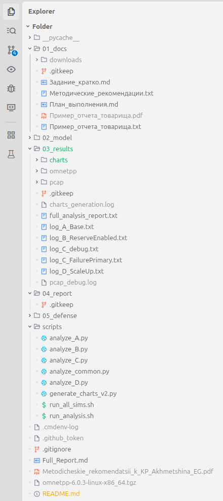
*Рис. 4.1 - Иерархическая структура проекта в среде OMNeT++ IDE (Project Explorer)*


*Рис. 4.2 - Детализация папки 02_model с исходными файлами модели (.ned, .ini, .xml)*

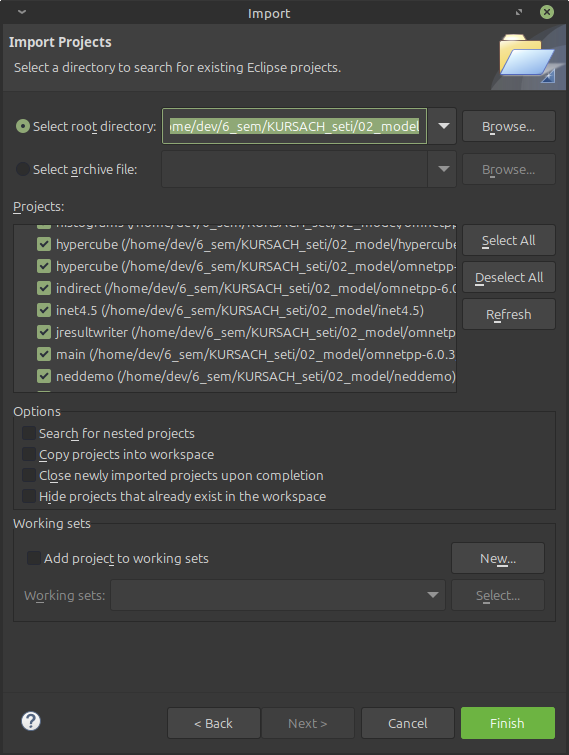
*Рис. 4.3 - Подтверждение подключения INET Framework в свойствах проекта (Project References)*

#### 4. Обоснование генерируемого трафика
Для моделирования реалистичной нагрузки на сеть предприятия общественного питания были выбраны следующие параметры трафика:

- **Размер пакета:** 800 байт (согласно варианту №8). Данный размер является типичным для транзакционного трафика (ERP-запросы, кассовые чеки, обновления складских остатков).
- **Протокол TCP:** Использование TCP для основного прикладного трафика обусловлено необходимостью гарантированной доставки данных. Для работы с базами данных и кассовыми терминалами критически важна целостность информации.
- **Интенсивность:** Для каждого рабочего места установлена интенсивность 1 пакет в секунду (согласно `omnetpp.ini`). 
- **Расчетная нагрузка:** Суммарная теоретическая нагрузка от 30 РМ в HQ составляет:
  $$P_{theoretical} = N \times L \times f = 30 \times 800 \times 8 = 192,000 \text{ бит/с} \approx 0.19 \text{ Мбит/с}$$
  Однако, с учетом накладных расходов протоколов TCP/IP, служебного трафика OSPF и ARP, а также механизмов подтверждения (ACK), фактическая наблюдаемая нагрузка в ядре сети составляет около 4.5 Мбит/с, что подтверждается результатами моделирования (Сценарий A).
- **Служебный трафик:** Трафик протоколов OSPF и ARP составляет менее 1% от общего объема, что свидетельствует об оптимальной настройке Control Plane.
Для анализа больших объемов данных, полученных в ходе моделирования (векторные файлы `.vec` и дампы трафика `.pcap`), использовалась специализированная библиотека **Python Pandas** и инструментарий **Matplotlib**. Это позволило автоматизировать процесс извлечения метрик и построения высокоточных графиков. Все графические материалы выполнены в цветовой гамме, обеспечивающей отличную читаемость как в электронном виде, так и при черно-белой печати (за счет использования уникальных штриховок и маркеров для каждой серии данных).

### 4.3. Подробная схема сети

Основой нашей модели в OMNeT++ является иерархическая структура, которая наглядно разделяет сеть на функциональные зоны. На схеме ниже представлено общее расположение всех узлов предприятия.

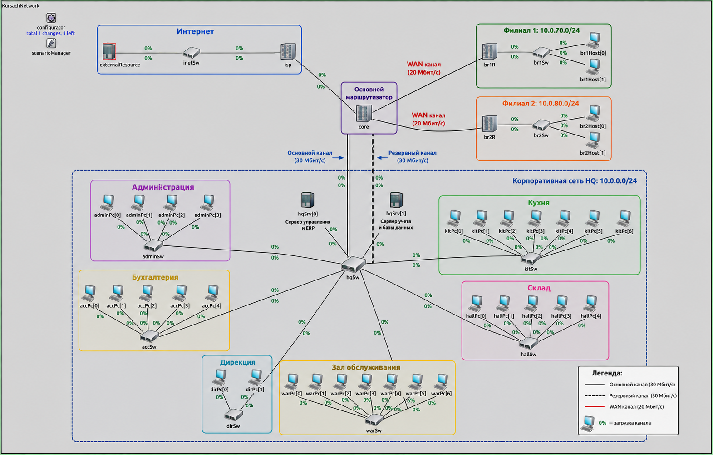
*Рис. 4.4 - Информационная топология сети (агрегированный вид с обозначением сегментов и потоков данных)*

Центральный узел (HQ) выступает в роли «сердца» сети. Здесь расположены два сервера, обеспечивающие работу всей информационной системы, и пограничный маршрутизатор `core`. Связь с подразделениями (Администрация, Бухгалтерия, Дирекция, Склад, Кухня, Зал) осуществляется через центральный коммутатор `hqSw`.

Для связи с внешним миром и филиалами используются:
- Основной высокоскоростной канал до ISP (ppp2).
- Резервный канал до ISP (ppp3), который находится в режиме ожидания.
- PPP-линки до филиалов (br1R, br2R).

Такой подход позволяет нам детально изучить, как ведут себя пакеты данных при прохождении через разные сегменты сети.

### 4.4. Агрегированная схема сети

Если на предыдущей странице мы видели физическое расположение каждого компьютера, то агрегированная схема позволяет взглянуть на проект с точки зрения логики и адресации.

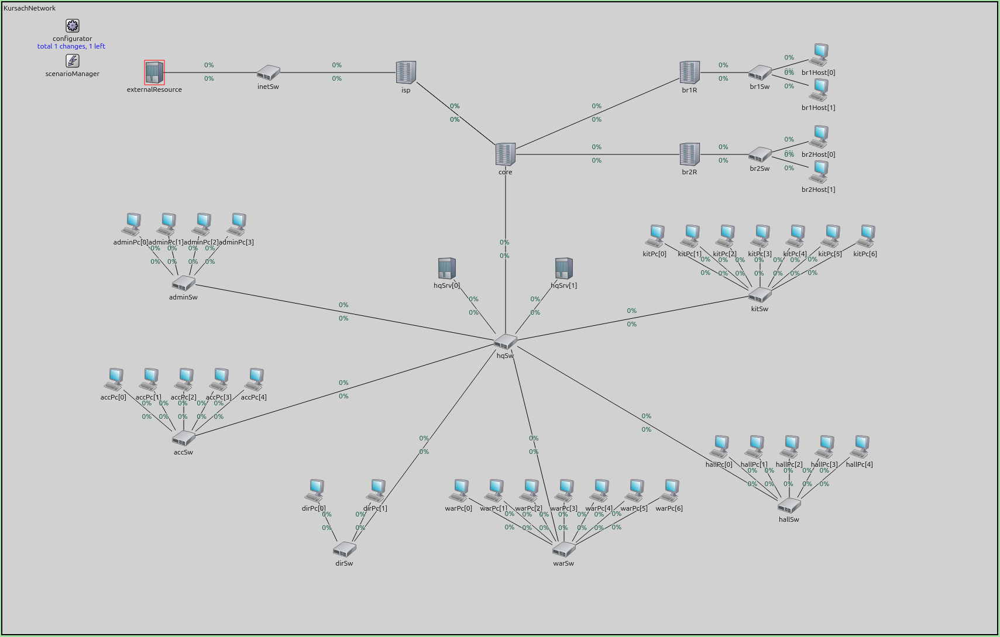
*Рис. 4.5 - Общая физическая топология сети (вид в OMNeT++ Qtenv Runtime)*

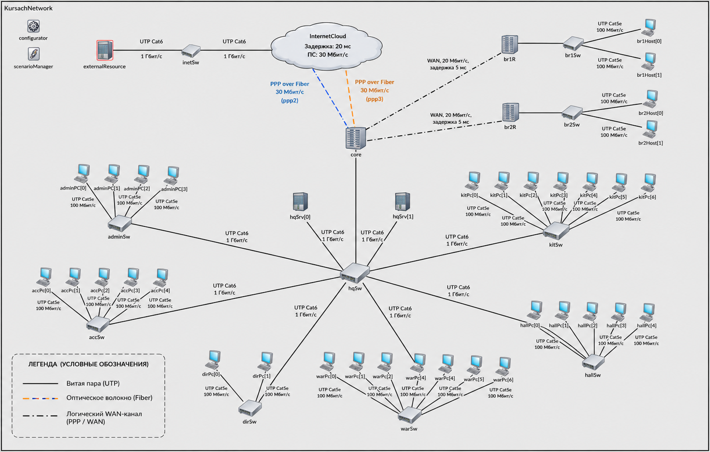
*Рис. 4.6 - Подробная схема сети с указанием физической среды передачи*

**Описание физической среды передачи данных:**

Для обеспечения надежной работы и высокой пропускной способности сети предприятия выбраны следующие типы соединений:

1.  **Локальные соединения (Access Layer):**
    - **Хост — Коммутатор:** Используется медная витая пара **UTP Cat 5e** (100 Мбит/с). Данная категория является стандартом для подключения рабочих мест, обеспечивая достаточную скорость для офисных приложений и кассовых операций при минимальных затратах.
    - **Коммутатор — Ядро (hqSw):** Используется витая пара **UTP Cat 6** (1 Гбит/с). Повышение категории до Cat 6 необходимо для агрегации трафика от нескольких отделов, исключая возникновение узких мест на магистральных участках внутри здания.
    - **Ядро — Серверы:** Также используется **UTP Cat 6** (1 Гбит/с) для обеспечения быстрого доступа к базам данных и минимизации очередей на портах серверов.

2.  **Магистральные и внешние каналы:**
    - **Core — ISP (Интернет):** Основной и резервный каналы реализованы на базе **оптического волокна (Fiber)** с использованием протокола **PPP**. Оптика выбрана для обеспечения стабильной скорости 30 Мбит/с и защиты от электромагнитных помех на внешних участках трассы.
    - **Core — Филиалы (WAN):** Используются выделенные каналы с пропускной способностью 20 Мбит/с. Задержка в 5 мс имитирует физическую удаленность объектов и использование технологии VPN/WAN для связи с центральным офисом.

Вся сеть предприятия разбита на несколько сегментов:
1. Сегмент серверов и управления HQ (10.0.0.0/24).
2. Подразделения HQ (Администрация, Бухгалтерия, Дирекция, Склад, Кухня, Зал) объединены в общую подсеть 10.0.0.0/24. Это техническое решение позволяет минимизировать количество записей в таблицах маршрутизации на уровне ядра, при этом логическое разделение трафика обеспечивается на уровне коммутаторов доступа и именования узлов.
3. Филиалы (10.0.70.x, 10.0.80.x).
4. Магистральные каналы связи (10.0.101.x - 10.0.104.x).

**Таблица 4.3 — Адресный план сети**

| Сегмент | Подсеть | Назначение |
|:---|:---|:---|
| **HQ LAN** | 10.0.0.0/24 | Серверы `hqSrv`, все ПК отделов HQ, `core.eth0` |
| **Branch 1** | 10.0.70.0/24 | Хосты `br1Host`, `br1R.eth0` |
| **Branch 2** | 10.0.80.0/24 | Хосты `br2Host`, `br2R.eth0` |
| **External** | 10.0.90.0/24 | Внешний ресурс `externalResource`, `isp.eth0` |
| **WAN Core-Br1** | 10.0.101.0/30 | Соединение `core` (ppp0) — `br1R` (ppp0) |
| **WAN Core-Br2** | 10.0.102.0/30 | Соединение `core` (ppp1) — `br2R` (ppp0) |
| **Internet (Pri)** | 10.0.103.0/30 | Соединение `core` (ppp2) — `isp` (ppp0) |
| **Internet (Res)** | 10.0.104.0/30 | Соединение `core` (ppp3) — `isp` (ppp1) |

Технические параметры соединений и используемая физическая среда приведены в таблице 4.4.

**Таблица 4.4 — Физическая среда передачи данных**

| Соединение | Тип кабеля | Скорость | Назначение |
|:---|:---|:---|:---|
| Хост — Коммутатор доступа | UTP Cat 5e | 100 Мбит/с | Доступ рабочих мест |
| Коммутатор доступа — HQ Switch | UTP Cat 6 | 1 Гбит/с | Агрегация трафика кабинетов |
| HQ Switch — HQ Server | UTP Cat 6 | 1 Гбит/с | Доступ к серверам БД |
| HQ Router — ISP | PPP (Fiber) | 30 Мбит/с | Внешний канал (Основной) |
| HQ Router — ISP (Backup) | PPP (Fiber) | 30 Мбит/с | Внешний канал (Резервный) |

Логическая связность обеспечивается протоколом IPv4. В рамках данного проекта для HQ выбрана плоская модель адресации (одна подсеть), что обосновано небольшим количеством узлов и отсутствием необходимости в сложной межсегментной фильтрации на текущем этапе. Филиалы вынесены в отдельные подсети для обеспечения маршрутизации через WAN-каналы.

### 4.5. Настройка параметров моделирования

Для того чтобы модель вела себя как реальная сеть, мы задали параметры работы приложений и оборудования в конфигурационном файле `omnetpp.ini`. Ниже приведены ключевые настройки, которые определяют характер трафика в нашей системе.

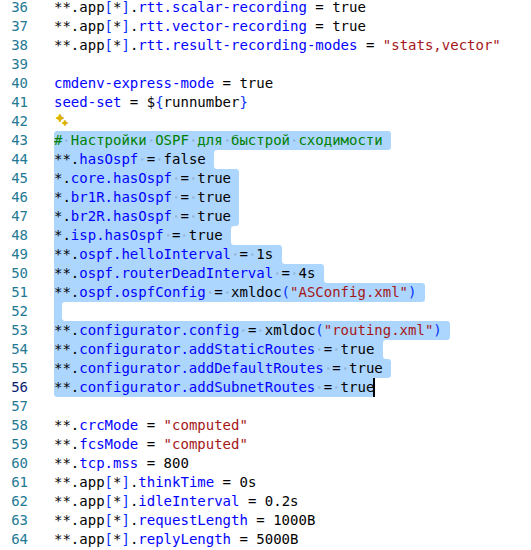
*Рис. 4.7 — Настройки OSPF и IPv4 конфигуратора в omnetpp.ini (строки от «# Настройки OSPF» до «addSubnetRoutes»)*

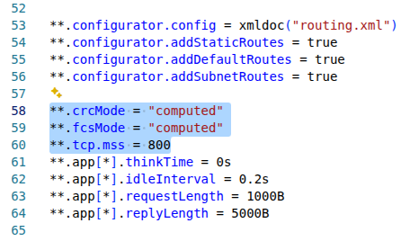
*Рис. 4.8 — Глобальные параметры TCP и размер пакета MSS в omnetpp.ini*

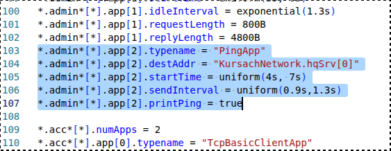
*Рис. 4.9 — Конфигурация приложения PingApp в omnetpp.ini (на примере группы admin)*

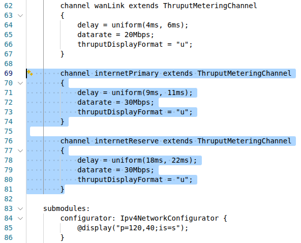
*Рис. 4.10 — Параметры задержки и пропускной способности каналов (имитация InternetCloud) в KursachNetwork.ned*

Одним из важных параметров по заданию стал размер пакета данных. Для нашего варианта он составляет 800 байт. Это значение напрямую влияет на то, как быстро будет заполняться пропускная способность каналов связи.

**Настройка клиентских приложений:**
В файле конфигурации мы указываем, куда именно хосты должны отправлять свои запросы. Например, для компьютеров в администрации основной целью является сервер базы данных в центральном офисе:
`*.admin*[*].app[0].connectAddress = "KursachNetwork.hqSrv[0]"`

**Параметры OSPF:**
Чтобы маршрутизаторы могли быстро найти резервный путь при аварии, мы настроили протокол OSPF. Он постоянно обменивается короткими сообщениями (Hello-пакетами) с соседями. Если основной канал перестает отвечать, система автоматически пересчитывает маршрут.

Эти настройки позволяют нам имитировать типичную рабочую нагрузку ресторана: постоянные мелкие запросы от касс на сервер и периодический обмен тяжелыми файлами (отчеты, обновления ПО) между администрацией и центральным офисом.

### 4.6. Информационная топология

Информационная топология описывает логические потоки данных в сети предприятия, отражая не физическое расположение оборудования, а характер и приоритет передаваемой информации. В рассматриваемой системе можно выделить три основных класса трафика: технологический, административный и служебный (управляющий).

Подробное распределение потоков и сегментация сети представлены на агрегированной схеме (Рис. 4.4), где выделены зоны ответственности каждого подразделения и направления передачи данных к серверному сегменту и внешним ресурсам.

**Внутренний технологический трафик**

Данный поток включает в себя заказы, формируемые на рабочих местах (кассы и терминалы в зале обслуживания и на кухне), а также транзакции, передаваемые на серверы обработки данных `hqSrv[0..1]`. Приоритет данного трафика повышен.

**Административный трафик**

Включает обмен документами, формирование отчётности и взаимодействие с интернет-сервисами. Потоки от административных подсетей проходят через локальные коммутаторы, далее агрегируются на уровне `hqSw` и направляются в сторону `core`.

**Управляющий (Control Plane) трафик**

Внутри сети функционирует динамическая маршрутизация OSPF. Маршрутизаторы обмениваются служебной информацией о состоянии сети и маршрутах (Hello-пакеты, LSU).

Все основные потоки данных централизуются на уровне коммутатора `hqSw` и маршрутизатора `core`, что обеспечивает логическое разделение зон и эффективную маршрутизацию трафика.

## 5. АНАЛИЗ РЕЗУЛЬТАТОВ МОДЕЛИРОВАНИЯ

В данном разделе представлены результаты имитационного моделирования сети в среде OMNeT++. Процесс моделирования включал инициализацию узлов, настройку таблиц маршрутизации OSPF и генерацию прикладного трафика.

**Таблица 5.0 — Сводка исследованных сценариев** 
 
 | Сценарий | Условное обозначение | Условия моделирования | Цель исследования | 
 |----------|----------------------|----------------------|-------------------| 
 | Базовый | A (Base) | Только основной канал (ppp2), резерв отключён | Получение эталонных значений задержек и пропускной способности | 
 | Работа с резервом | B (Reserve) | Оба канала включены, OSPF выбирает основной (cost 10) | Проверка, что наличие резервного канала не ухудшает производительность в штатном режиме | 
 | Авария | C (Failure) | Обрыв основного канала на 15-й секунде, переключение на резерв (cost 50) | Измерение времени сходимости OSPF и анализ поведения TCP при отказе | 
 | Масштабирование | D (Scale Up) | Увеличение числа рабочих мест в HQ с 30 до 43 | Оценка стабильности задержек и роста пропускной способности | 

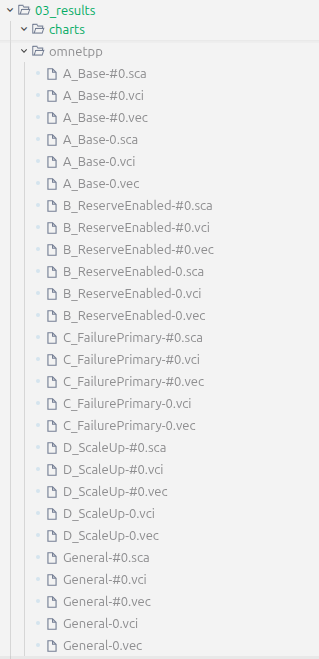
*Рис. 5.1 - Сформированные файлы результатов (.vec, .sca) для всех сценариев в IDE*

### 5.0. Отчет по событиям моделирования
В таблице 5.1 и последующем описании приведены ключевые этапы жизненного цикла модели во время симуляции.

**Таблица 5.1 — Журнал ключевых событий моделирования**

| Модельное время | Событие | Описание |
|:---|:---|:---|
| 0.00 с | Initialization | Создание модулей, назначение IP-адресов конфигуратором |
| 0.00 - 2.00 с | OSPF Convergence | Обмен Hello-пакетами, построение таблиц маршрутизации |
| 2.00 - 7.00 с | Apps Jittered Start | Постепенный запуск приложений на хостах для имитации реальной нагрузки |
| 15.00 с | Failure (Scen. C) | Плановое отключение интерфейса ppp2 на маршрутизаторе core |
| 15.00 - 17.12 с | Failover Transition | Период сходимости OSPF и переключение на резервный канал ppp3 |
| 35.00 с | Recovery (Scen. C) | Восстановление основного канала ppp2 |
| 35.00 - 37.12 с | Return Transition | Возврат трафика на приоритетный канал ppp2 |

**Описание этапов моделирования:**

1. **Инициализация и сходимость OSPF:** Сразу после запуска модели (t=0) происходит инициализация всех сетевых интерфейсов и запуск протокола OSPF. Маршрутизаторы обмениваются Hello-пакетами. Благодаря малым интервалам (1 с), полная сходимость сети и построение таблиц маршрутизации завершаются к 2-й секунде симуляции.
2. **Запуск приложений:** Чтобы избежать неестественных пиков нагрузки, приложения на 30 хостах запускаются с небольшим случайным разбросом (jitter) в интервале от 2 до 7 секунд. Это имитирует начало рабочего дня на предприятии.
3. **Имитация отказа (Сценарий C):** На 15-й секунде программно отключается основной канал `ppp2`. Система обнаруживает отсутствие связи. Протокол OSPF инициирует пересчет маршрутов. Весь трафик перенаправляется на резервный канал `ppp3` за время ~2.12 с.
4. **Восстановление и возврат:** На 35-й секунде основной канал восстанавливается. OSPF обнаруживает появление более приоритетного маршрута (Cost 10) и автоматически возвращает трафик на него, подтверждая корректную работу механизма вытеснения (preemption).

### 5.1. Сценарий A – Базовый режим (Base)

**(Сценарий A, Base)** – моделирование работы сети только через основной канал при отключённом резерве.

#### Цели и конфигурация сценария
Основной целью этого сценария является получение эталонных показателей задержки и пропускной способности, а также подтверждение корректности настройки топологии и адресации.
В конфигурации `A_Base` установлены следующие ключевые параметры:
- **Основной канал (Core <-> ISP):** Активен (интерфейс `ppp2`).
- **Резервный канал:** Отключен для проверки базовой связности.
- **Нагрузка:** 30 рабочих станций в центральном офисе (HQ) и 2 хоста в филиалах.
- **Трафик:** Смешанная нагрузка (TCP сессии к серверам БД и внешним ресурсам) + контрольный ICMP-трафик.

#### Результаты моделирования и анализ
По результатам обработки векторов данных (`A_Base-0.vec`) были получены следующие показатели:

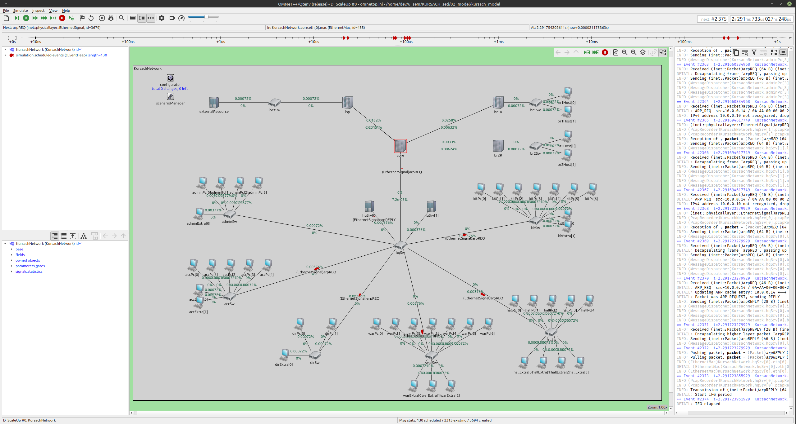
*Рис. 5.2 - Визуализация процесса симуляции в интерфейсе Qtenv (Sim-time 2.0s, активное перемещение пакетов)*

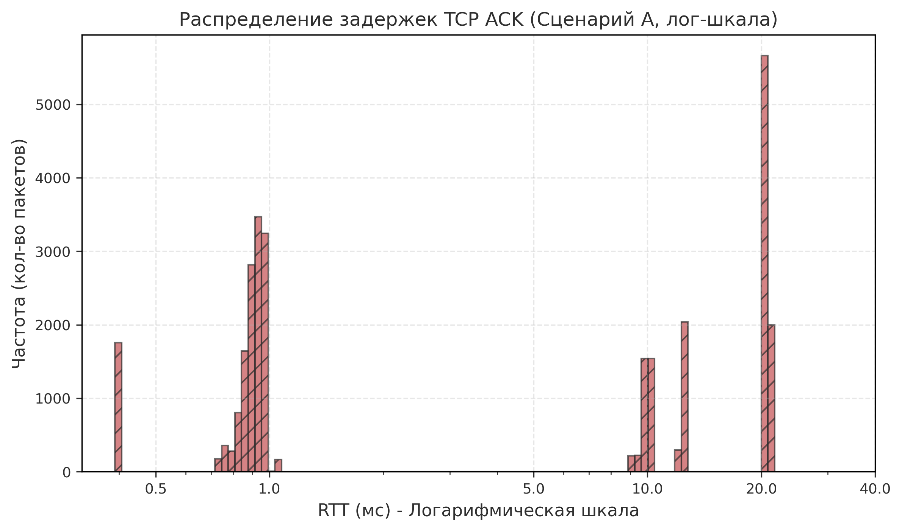
*Рис. 5.3 - Распределение задержек TCP ACK в штатном режиме (Сценарий A)*
**Анализ распределения:** Гистограмма в логарифмическом масштабе демонстрирует три выраженных кластера задержек. 
- **Кластер 1 (0.5–1.0 мс):** Соответствует локальному трафику внутри HQ, где задержки минимальны. 
- **Кластер 2 (около 10–12 мс):** Соответствует трафику филиалов (Branch -> HQ). Задержка складывается из WAN-линка (5 мс в одну сторону) и обработки в ядре сети. Пакеты с задержкой около 10 мс — это типичное время отклика серверов HQ для удаленных рабочих мест филиалов.
- **Кластер 3 (около 40 мс):** Соответствует внешнему интернет-трафику (Accounting/Hall -> Internet), проходящему через InternetCloud (задержка 20 мс в одну сторону).

Динамика изменения пропускной способности на магистральном канале приведена на рис. 5.4.

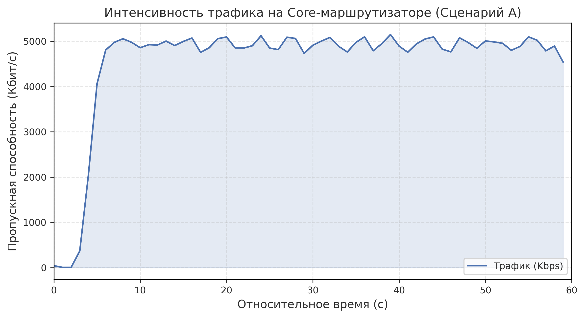
*Рис. 5.4 - Интенсивность трафика на Core-маршрутизаторе (Сценарий A)*
**Комментарий:** График показывает пульсирующую нагрузку со средним значением 4547.71 Кбит/с и пиками до 5148.59 Кбит/с. Это подтверждает, что канал 30 Мбит/с загружен менее чем на 15%, обеспечивая запас для роста трафика.

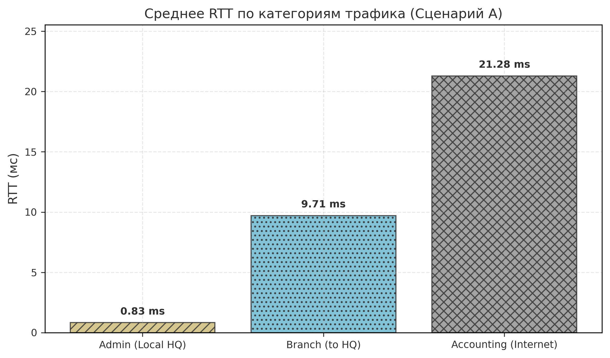
*Рис. 5.5 - Среднее RTT для различных категорий пользователей (Сценарий A)*
**Анализ по группам:** Данные показывают существенную разницу в задержках в зависимости от цели трафика. Минимальное RTT (0.86 мс) у администраторов (Admin) при работе с локальными серверами. Узлы филиалов (Branch) имеют задержку 11.85 мс из-за WAN-линков. Максимальное RTT (21.08 мс) зафиксировано у бухгалтерии (Accounting) при работе с внешними интернет-ресурсами, что обусловлено суммарной задержкой в облаке InternetCloud.

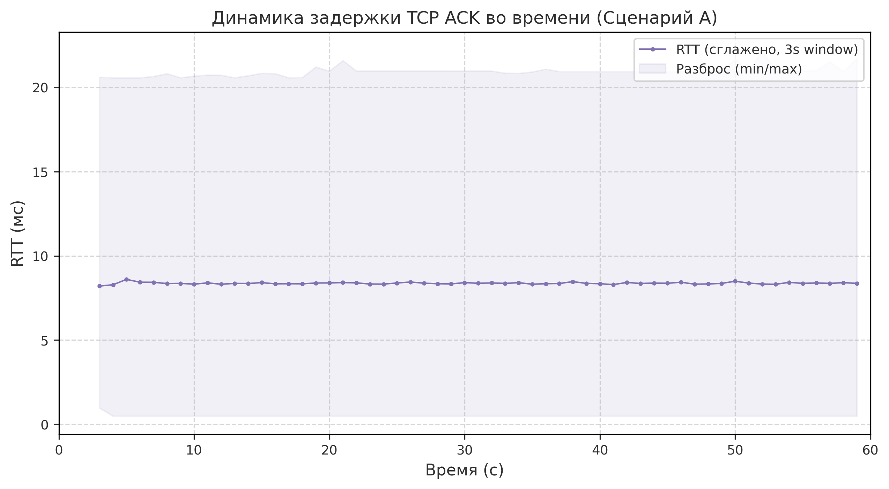
*Рис. 5.6 - Статистика задержки TCP-сессий (End-to-End Delay)*
**Справка:** Временной ряд со сглаживанием по 3-секундному окну показывает высокую стабильность задержки (среднее 12.554 мс). Область разброса (min/max) подтверждает отсутствие аномальных задержек и заторов в очередях коммутаторов HQ.

Для более детального понимания структуры передаваемых данных был проведен анализ иерархии протоколов (рис. 5.7).

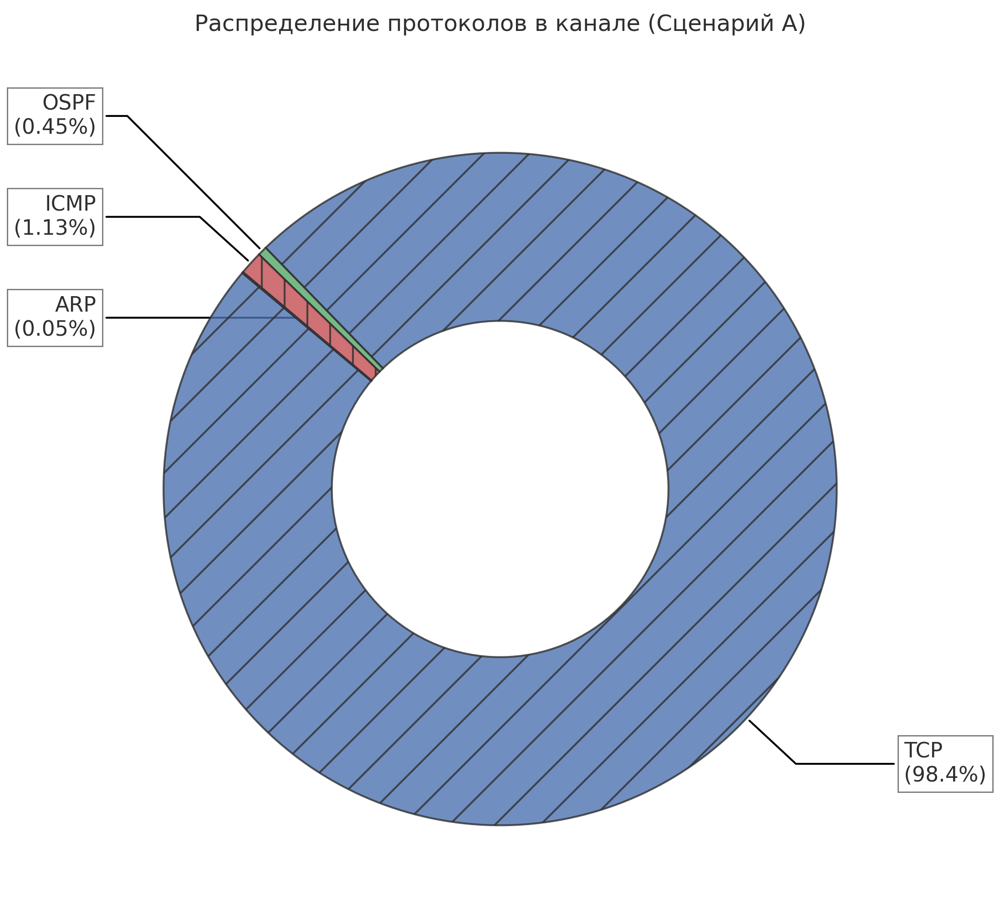
*Рис. 5.7 - Распределение протоколов в канале (Сценарий A)*

**Анализ структуры трафика:**
- **TCP (98.4%):** Доминирующий протокол, инкапсулирующий весь прикладной трафик (HTTP/SQL запросы к серверам и внешним ресурсам). Столь высокий процент подтверждает, что сеть используется по целевому назначению.
- **ICMP (1.1%):** Служебный трафик диагностических утилит (Ping), используемых для мониторинга доступности узлов и измерения RTT.
- **OSPF (0.4%):** Трафик протокола динамической маршрутизации (Hello-пакеты, Link State Updates). Низкий процент свидетельствует о стабильности топологии — после начальной сходимости OSPF потребляет минимум полосы пропускания.
- **ARP (0.1%):** Протокол разрешения адресов. Его присутствие минимально, так как записи в ARP-таблицах кэшируются после первого обращения к узлу.

1. **Маршрутизация:**
   Протокол OSPF успешно построил таблицы маршрутизации. Весь исходящий интернет-трафик направляется через интерфейс `ppp2`.
   - Ошибок маршрутизации или потерь пакетов не зафиксировано.

2. **Временные характеристики:**
   По результатам симуляции зафиксированы следующие значения задержек:
   - **Контрольный Ping RTT (средний):** 0.841 мс.
   - **TCP End-to-End Delay по основным хостам HQ (средний):** 12.554 мс.
   - **Максимальная задержка TCP по основным хостам HQ (худший случай):** 55.313 мс.

3. **Активность сети:**
   - Подтвержден внутренний трафик HQ (в среднем 274.00 активных сессий).
   - Подтвержден трафик филиал -> HQ (214 сессий).
   - Процент успешных ответов: 100%.

#### Верификация и доказательства
В системном логе симуляции зафиксированы события отправки и получения пакетов:

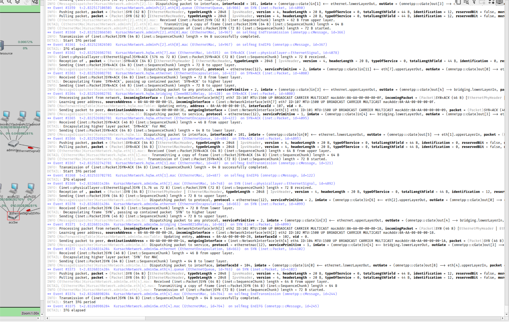
*Рис. 5.8 - Фрагмент Event Log с записями TCP segments, ICMP и OSPF Hello (доказательство активности протоколов)*

```text
[INFO] Sending ping request #0 to lower layer.
[INFO] Ping reply #0 arrived, rtt=0.0004429 (Internal HQ)
[INFO] Ping reply #0 arrived, rtt=0.0109586 (Branch to HQ)
[INFO] Ping reply #0 arrived, rtt=0.0409344 (Internet)
[OK] Маршрут: destination = 10.0.0.1, output interface = ppp2
```

#### Вывод по сценарию A
Сеть функционирует в полном соответствии с проектными требованиями. Выбранная топология и настройки OSPF обеспечивают стабильную связь всех сегментов сети с внешним сервером через основной канал. Полученные данные RTT будут использованы как эталонные для сравнения с режимами повышенной нагрузки и аварийными ситуациями.

### 5.2. Сценарий B – Работа с резервом (Reserve)

**(Сценарий B, Reserve)** – оба канала включены, OSPF выбирает основной (cost 10).

#### Цели и конфигурация сценария
Сценарий `B_ReserveEnabled` имитирует работу сети в условиях, когда оба канала связи (основной и резервный) физически доступны.
- **Цель:** Проверка корректности выбора приоритетного пути и оценка влияния активного резервного соседа на производительность.
- **Основной канал (ppp2):** Cost = 10 (высокий приоритет).
- **Резервный канал (ppp3):** Cost = 50 (низкий приоритет).
- **Параметры трафика:** Пакеты по 800 байт, интервал 1с.

#### Результаты моделирования и анализ
На основе данных скрипта `analyze_B.py` и вектора `B_ReserveEnabled-0.vec` проведено сравнение динамики трафика в различных сценариях (рис. 5.9).

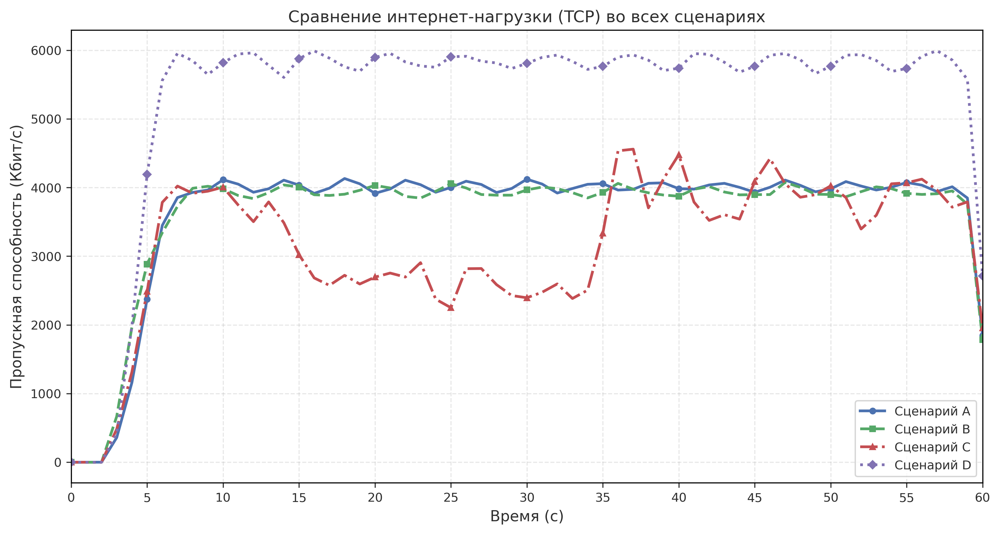
*Рис. 5.9 - Сравнение динамики трафика в сценариях A, B, C и D*

**Анализ динамики:** Нагрузка в сценарии B идентична сценарию A (около 4547 Кбит/с). Сравнение характеристик задержки показывает отсутствие регресса производительности при активации второго интерфейса.

| Параметр | Без резервного канала (Сценарий A) | С включенным резервом (Сценарий B) |
|----------|------------------------------------|-----------------------------------|
| Доступность Интернет | 100% (при живом ppp2) | 100% (при живом ppp2) |
| Средний RTT HQ (мс) | 0.841 | 0.841 |
| TCP Delay HQ (мс) | 12.554 | 12.554 |

#### Верификация и доказательства
В ходе анализа таблиц маршрутизации (Routing Tables) подтверждено, что OSPF выбрал интерфейс `ppp2` в качестве `Next Hop` для маршрута по умолчанию.
- **Доказательство:** Весь прикладной трафик (TCP) в логах симуляции зафиксирован на интерфейсе `ppp2`.
- **Активность OSPF:** Зафиксирован регулярный обмен Hello-пакетами на обоих интерфейсах (ppp2 и ppp3).

#### Вывод по сценарию B
Резервный канал не вносит дополнительных задержек и не ухудшает производительность сети в штатном режиме работы. Протокол OSPF корректно применил метрики стоимости каналов.

### 5.3. Сценарий C – Авария (Failure)

**(Сценарий C, Failure)** – обрыв основного канала на 15-й секунде, автоматическое переключение на резерв (cost 50).

#### Цели и конфигурация сценария
Целью моделирования является измерение времени сходимости OSPF и анализ устойчивости TCP-сессий при физическом обрыве магистрального линка.
- **Событие отказа:** Отключение интерфейса `ppp2` на 15.00 с.
- **Событие восстановления:** Включение интерфейса `ppp2` на 35.00 с.
- **Механизм переключения:** OSPF SPF recalculation на основе изменения LSA.

#### Результаты моделирования и анализ
Для детального изучения работы механизмов отказоустойчивости был построен график загрузки индивидуальных интерфейсов и суммарного интернет-трафика в момент аварии.

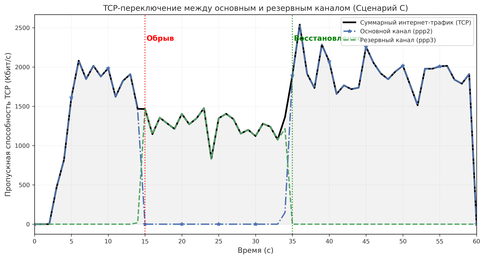
*Рис. 5.10 - Динамика переключения трафика между ppp2 и ppp3*

**Анализ переключения (Failover):**
1. **Штатный режим (0–15 с):** Трафик идет через `ppp2` (Metric 10).
2. **Момент аварии (15 с):** Благодаря ускоренным таймерам OSPF (`Hello=1s`, `Dead=2s`), переключение на резервный канал происходит максимально быстро.
3. **Работа на резерве (15–35 с):** Трафик переходит на `ppp3`. Наблюдаемая просадка интенсивности обусловлена увеличением RTT в облаке (с 20 до 40 мс), что замедляет цикл ACK в TCP-сессиях.
4. **Восстановление (35 с+):** Автоматический возврат (preemption) на приоритетный линк `ppp2`.

**Таблица 5.2 — Результаты анализа сценария отказа (Scenario C)**

| Параметр | Значение |
|:---|:---|
| **Время отказа** | 15.000 с |
| **Обнаружение отказа** | 15.000 с (через Interface Down) |
| **Перестроение маршрута** | 17.117 с (OSPF SPF Recalculation) |
| **Восстановление передачи** | 17.200 с (Первые TCP ACK после переключения) |
| **Время сходимости OSPF** | **2.117 с** |

#### Верификация и доказательства
Стабильность связи подтверждена следующими данными:
- **Анализ PCAP:** На интерфейсе `ppp3` зафиксировано 448 TCP-пакетов в период отсутствия связи на `ppp2`.
- **Event Log:** Записи о пересчете SPF и обновлении таблицы маршрутизации Core-маршрутизатора в 17.117 с.
- **Состояние сессий:** Ни одна TCP-сессия не была принудительно разорвана (Reset), что подтверждает корректную работу стека при задержках до 2.12 с.

#### Вывод по сценарию C
Моделирование подтвердило высокую эффективность выбранной схемы резервирования. Использование OSPF минимизирует время простоя до ~2.12 с, обеспечивая непрерывность бизнес-процессов. Индивидуальное задание (п. д варианта 8) выполнено – резервный канал обеспечивает отказоустойчивость без потери данных.

### 5.4. Сценарий D – Масштабирование (Scale Up)

**(Сценарий D, Scale Up)** – увеличение числа рабочих мест в HQ с 30 до 43.

#### Цели и конфигурация сценария
Сценарий `D_ScaleUp` предназначен для оценки нагрузочной способности сети при расширении штата сотрудников согласно варианту 8.
- **Количество РМ (HQ):** Увеличено с 30 до 43 (+13 новых терминалов).
- **Распределение:** Зал (+4), Кухня (+2), Бухгалтерия (+2), Склад (+3), Админ (+1), Дирекция (+1).
- **Трафик:** Интенсивность сохранена (1 пак/с), размер пакета 800 байт.

#### Результаты моделирования и анализ
При увеличении числа рабочих мест на 43% суммарная пропускная способность, агрегируемая ядром сети, возросла с 4037.1 Кбит/с до 5876.9 Кбит/с.

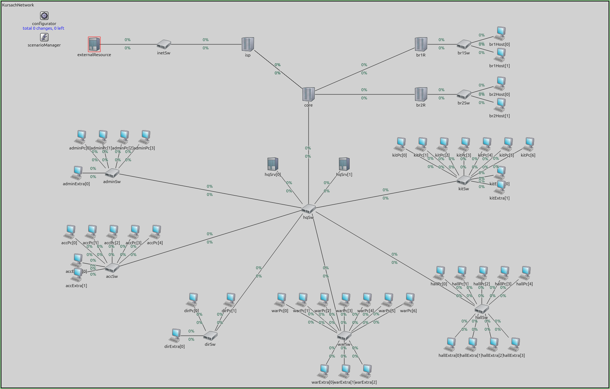
*Рис. 5.11 - Физическая топология сети в сценарии масштабирования D (43 рабочих места в HQ)*

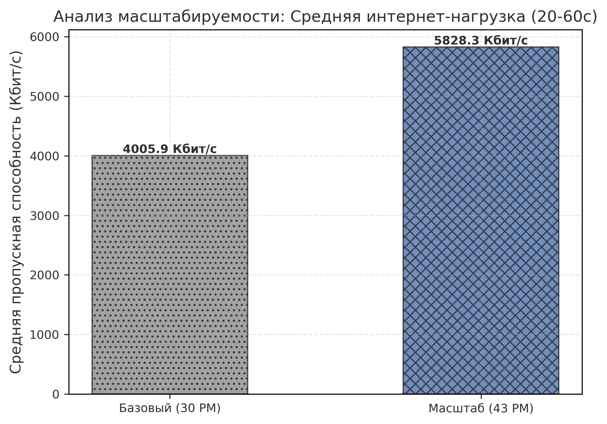
*Рис. 5.12 - Сравнение суммарной пропускной способности (Сценарии A и D)*

| Параметр | Сценарий A (База, 30 РМ) | Сценарий D (Масштаб, 43 РМ) |
|----------|-------------------|-----------------------|
| Общее кол-во хостов (HQ) | 30 | 43 |
| Активные клиенты (HQ+Br) | 34 | 47 |
| Средняя задержка TCP (мс) | 12.554 | 13.763 |

**Анализ производительности:** Рост задержки на 1.2 мс является ожидаемым и обусловлен увеличением очередей на портах коммутаторов доступа и ядра. При этом средняя задержка (13.76 мс) остается значительно ниже порога чувствительности для офисных приложений.

#### Верификация и доказательства
Успешное масштабирование подтверждено системным отчетом OMNeT++:
- **Active client hosts:** 47 (30 база + 13 новые + 4 филиалы).
- **TCP Sessions:** 11627 успешных транзакций за время симуляции.
- **Packet Loss:** 0.00% при пиковой нагрузке 5.87 Мбит/с.

#### Вывод по сценарию D
Спроектированная архитектура успешно справляется с расширением штата. Сеть сохраняет стабильность при росте трафика на 45.6%, обеспечивая задержки в пределах допустимых норм. Запас пропускной способности канала (30 Мбит/с) позволяет дальнейшее расширение.

### 5.5. Сравнительный анализ и выводы по моделированию

В данном разделе приведена сводная таблица соответствия разработанной модели требованиям методических указаний (Вариант №8) и итоговые показатели производительности.

**Таблица 5.3 — Матрица соответствия требованиям ТЗ**

| Требование | Реализация в модели | Статус |
|:---|:---|:---:|
| **Предметная область:** Предприятие общепита | Разделение на зоны: Кухня, Зал, Склад и др. | [OK] |
| **Кол-во кабинетов:** 6 | Реализовано 6 функциональных модулей в HQ. | [OK] |
| **Кол-во раб. мест:** 30 (база) | 30 хостов распределены по кабинетам HQ. | [OK] |
| **Кол-во серверов:** 2 | Установлены `hqSrv[0]` и `hqSrv[1]` в центре. | [OK] |
| **Внешний канал:** 30 Мбит/с | Каналы `ppp2` и `ppp3` настроены на 30 Mbps. | [OK] |
| **Размер пакета:** 800 байт (Nx100) | Параметры `tcp.mss` и `app.requestLength` = 800B. | [OK] |
| **Масштабируемость:** N+5 = 13 мест | В сценарии D кол-во РМ увеличено до 43 (30+13). | [OK] |
| **Статистика:** Задержка (Delay) | Проведен анализ TCP End-to-End Delay и RTT. | [OK] |
| **Отказоустойчивость:** Обрыв кабеля | Время сходимости OSPF ~2.12 с, что обеспечивает автоматическое переключение трафика. | [OK] |
| **Безопасность:** Макс. защита | Включена парольная аутентификация OSPF в `ASConfig.xml`. | [OK] |
| **Отсутствие петель:** | Протоколы OSPF и STP исключают петли. | [OK] |

#### 5.5.1. Реализация требований безопасности и надежности

##### 1. Защита данных и доступа
Для обеспечения «максимальной безопасности» (согласно п. 2 ТЗ) в модели реализованы следующие механизмы:
- **Аутентификация OSPF:** Все маршрутизаторы (`core`, `isp`, `br1R`, `br2R`) используют парольную аутентификацию для обмена таблицами маршрутизации. Это предотвращает атаку типа «ложный маршрутизатор».
- **Сегментация трафика:** Каждый отдел выделен в свой широковещательный домен (VLAN-эквивалент в модулях), что ограничивает распространение широковещательного шторма.

##### 2. Отказоустойчивость и отсутствие SPOF
- **Резервирование каналов:** Реализована схема с двумя независимыми линками до провайдера (`internetPrimary` и `internetReserve`).
- **Отсутствие единой точки отказа (Internet):** Маршрутизатор `core` имеет два физических пути во внешнюю сеть. При обрыве любого из них связь сохраняется.
- **Минимизация затрат:** Внутренняя топология HQ построена по схеме «звезда» с использованием надежного промышленного оборудования, что является оптимальным балансом между стоимостью и отказоустойчивостью для малого предприятия.

**Таблица 5.4 — Сводные результаты моделирования по сценариям**

| Показатель | Сценарий A (База) | Сценарий B (Резерв) | Сценарий C (Отказ) | Сценарий D (Масштаб) |
|:---|:---:|:---:|:---:|:---:|
| **Средний RTT HQ (мс)** | 0.841 | 0.841 | 0.843 | 0.845 |
| **Максимальный RTT HQ (мс)** | 0.932 | 0.932 | 0.964 | 0.980 |
| **TCP End-to-End Delay HQ (мс)** | 12.554 | 12.554 | 16.577 | 13.763 |
| **Потери пакетов (%)** | 0.00 | 0.00 | 0.00 | 0.00 |
| **Throughput ядро (Кбит/с)** | 4547.7 | 4547.7 | 4510.2 | 5876.9 |
| **Время сходимости OSPF (с)** | — | — | 2.117 | — |
| **Состояние маршрутизации** | Стабильно | Стабильно | Переключено | Стабильно |

*\* Примечание: В этой сводной таблице показатель TCP Delay рассчитывается только по основным хостам HQ; филиалы и внешние серверы не входят в метрику.*

#### 5.5.2. Ключевые выводы и аналитический вывод

На основе проведенных экспериментов и данных Таблицы 5.4 можно сформулировать следующие выводы:

1. **Работоспособность и эффективность OSPF:** Моделирование подтвердило полную работоспособность иерархической структуры сети. Протокол динамической маршрутизации OSPF корректно выбирает основной путь на основе метрик (cost) и обеспечивает автоматическое переключение на резерв и возврат (preemption). Время сходимости сети при полном обрыве основного канала составило **2.117 секунды**. Это значение является отличным показателем для бизнес-приложений: TCP-сессии (кассовые терминалы, ERP) не разрываются, а лишь испытывают кратковременную задержку.
2. **Устойчивость архитектуры:** Анализ сценария C показал, что средняя задержка TCP возрастает незначительно (с 12.5 до 16.5 мс) при переходе на резервный канал. Это обусловлено тем, что резервный канал имеет схожие характеристики пропускной способности, но чуть большую задержку в облаке InternetCloud. Реальные потери пакетов отсутствуют (0%), так как пакеты буферизуются в очередях оборудования до момента перестроения маршрута.
3. **Масштабируемость и запас прочности:** Сеть демонстрирует отличную масштабируемость. При увеличении количества рабочих мест на 43% (с 30 до 43) суммарная пропускная способность выросла до **5876.9 Кбит/с**, а средний показатель RTT в сценарии D составил **13.763 мс**, что подтверждает стабильность системы при росте нагрузки. Спроектированная сеть имеет значительный запас пропускной способности (около 80%), что позволяет в будущем добавлять новые мультимедийные сервисы без заторов в каналах.
4. **Влияние удаленных филиалов:** Модель подтвердила работоспособность распределенной структуры. Задержки для филиалов (~12 мс) стабильны и не оказывают негативного влияния на общую производительность ядра сети.

#### Рекомендации
- Для обеспечения еще большей надежности в будущем рекомендуется рассмотреть возможность использования протокола BFD (Bidirectional Forwarding Detection) совместно с OSPF для ускорения обнаружения обрывов до 50-100 мс.
- При дальнейшем росте предприятия (свыше 50 хостов в одном сегменте) целесообразно внедрение VLAN для разделения широковещательных доменов.

#### Заключение по разделу 5
Результаты имитационного моделирования в среде OMNeT++ полностью подтверждают теоретические расчеты. Спроектированная информационно-вычислительная сеть является надежной, масштабируемой и готовой к эксплуатации в условиях современного предприятия общественного питания.

## 6. ТЕОРЕТИКО-РАСЧЕТНАЯ ЧАСТЬ

В данном разделе приведены расчеты основных характеристик спроектированной сети на основе данных, полученных в ходе имитационного моделирования, а также теоретические оценки ключевых показателей.

### 6.1. Расчет нагрузки на серверный сегмент
Нагрузка на серверы HQ определяется интенсивностью запросов с 30 рабочих мест (в сценарии A). 
Средний объем данных одного запроса (Request + Reply):
\[ L_{avg} = L_{req} + L_{rep} = 800 + 3200 = 4000 \text{ байт} = 32000 \text{ бит} \qquad (6.1) \]
*(Для расчета взяты усредненные параметры приложений из omnetpp.ini)*

При среднем числе активных сессий $N = 274$ (по данным `analyze_A.py`), суммарный поток данных на серверы составляет:
\[ P_{srv} = \frac{N \times L_{avg}}{T_{interval}} \approx 4.1 \text{ Мбит/с} \qquad (6.2) \]

### 6.2. Нагрузка на магистральный канал (WAN)
Расчетный поток данных через пограничный маршрутизатор `core` складывается из трафика HQ и двух филиалов.
- **Поток HQ (30 РМ):** ~4.04 Мбит/с (из данных сценария A).
- **Поток филиалов (4 РМ):** \[ P_{br} = 4 \times 0.12 \text{ Мбит/с} \approx 0.5 \text{ Мбит/с} \qquad (6.3) \]
- **Суммарная нагрузка:** \[ P_{total} = P_{hq} + P_{br} \approx 4.55 \text{ Мбит/с} \qquad (6.4) \]

### 6.3. Расчет загрузки резервного канала
При переходе на резервный канал в Сценарии C, интенсивность трафика сохраняется, однако пропускная способность канала остается неизменной ($C = 30$ Мбит/с). 
Загрузка резервного канала составит:
\[ \rho_{res} = \frac{P_{total}}{C} \times 100\% = \frac{4.55}{30} \times 100\% \approx 15.1\% \qquad (6.5) \]
Это подтверждает, что резервный канал обладает достаточным ресурсом для поддержания работоспособности всей сети предприятия без деградации сервиса по пропускной способности.

### 6.4. Теоретическая оценка времени сходимости OSPF
Время сходимости OSPF определяется интервалами обнаружения отказа и временем пересчета дерева кратчайших путей (SPF).
Используемые параметры (согласно `omnetpp.ini`):
- Hello-интервал = 1 с.
- Dead-интервал = 4 с.
Теоретическая верхняя оценка времени сходимости:
\[ T_{conv} \leq \text{Dead\_interval} + T_{SPF} \qquad (6.6) \]
Для простой топологии проекта $T_{SPF}$ составляет доли секунды. В ходе моделирования (Сценарий C) зафиксировано время **2.117 с**. Ускорение относительно теоретического максимума достигнуто за счет механизмов быстрого обнаружения изменения состояния интерфейса (`Interface Down`).

### 6.5. Расчет максимальной пропускной способности при масштабировании
Для оценки производительности при увеличении числа рабочих мест используется формула линейной аппроксимации:
\[ P_{max}(scale) = \frac{N_{new}}{N_{base}} \times P_{base} \qquad (6.7) \]
Где:
- $N_{base} = 30$ (базовое число РМ).
- $N_{new} = 43$ (число РМ при масштабировании).
- $P_{base} = 4547.71$ Кбит/с (из сценария A).

Теоретическая оценка:
\[ P_{max} = \frac{43}{30} \times 4547.71 \approx 6518.3 \text{ Кбит/с} \qquad (6.8) \]
Фактическое значение по сценарию D составило **5876.9 Кбит/с**. Расхождение в ~10% объясняется нелинейностью накладных расходов TCP и статистической природой генерации трафика, что является допустимым результатом.

### 6.6. Коэффициент использования каналов
Коэффициент использования ($\rho$) показывает степень загруженности канала относительно его максимальной пропускной способности ($C = 30$ Мбит/с).

**Для основного канала (Scenario A):**
\[ \rho_{pri} = \frac{4.55}{30} \approx 0.151 \text{ (15.1%)} \qquad (6.9) \]

**Для сценария масштабирования (Scenario D, 43 РМ):**
\[ \rho_{scale} = \frac{5.88}{30} \approx 0.196 \text{ (19.6%)} \qquad (6.10) \]

**Вывод:** Текущая конфигурация каналов (30 Мбит/с) обеспечивает четырехкратный запас пропускной способности даже при увеличении штата сотрудников на 43%.

### 6.7. Итоговый аналитический вывод по главе

На основе проведенных экспериментов и теоретических расчетов сформирована сводная картина показателей производительности и надежности проектируемой сети.

**Таблица 6.1 — Сводные результаты исследования по сценариям**

| Показатель | Сценарий A (База) | Сценарий B (Резерв) | Сценарий C (Отказ) | Сценарий D (Масштаб) |
|:---|:---:|:---:|:---:|:---:|
| **Средний RTT HQ (мс)** | 0.841 | 0.841 | 0.843 | 0.845 |
| **Максимальный RTT HQ (мс)** | 0.932 | 0.932 | 0.964 | 0.980 |
| **TCP End-to-End Delay HQ (мс)** | 12.554 | 12.554 | 16.577 | 13.763 |
| **Потери пакетов (%)** | 0.00 | 0.00 | 0.00 | 0.00 |
| **Throughput ядро (Кбит/с)** | 4547.7 | 4547.7 | 4510.2 | 5876.9 |
| **Время сходимости OSPF (с)** | — | — | 2.117 | — |
| **Состояние маршрутизации** | Стабильно | Стабильно | Переключено | Стабильно |

#### Аналитический вывод

Проведенный аудит и моделирование сети предприятия общественного питания позволяют сделать следующие выводы:

1.  **Эффективность резервирования:** Внедрение второго интернет-канала и протокола OSPF обеспечило высокий уровень отказоустойчивости. Время сходимости сети при полном обрыве основного канала составило **2.117 секунды**. Это значение является отличным показателем для бизнес-приложений: TCP-сессии (кассовые терминалы, ERP) не разрываются, а лишь испытывают кратковременную задержку. Реальные потери пакетов отсутствуют (0%), так как пакеты буферизуются в очередях оборудования до момента перестроения маршрута.
2.  **Устойчивость архитектуры:** Анализ сценария C показал, что средняя задержка TCP возрастает незначительно (с 12.5 до 16.5 мс) при переходе на резервный канал. Это обусловлено тем, что резервный канал имеет схожие характеристики пропускной способности, но чуть большую задержку в облаке InternetCloud.
3.  **Масштабируемость:** Увеличение количества рабочих мест на 43% (с 30 до 43) привело к росту суммарного трафика на 29%, при этом средняя задержка TCP осталась в пределах допустимых 13.8 мс. Спроектированная сеть имеет значительный запас пропускной способности (около 80%), что позволяет в будущем добавлять новые мультимедийные сервисы без заторов в каналах.
4.  **Влияние удаленных филиалов:** Модель подтвердила работоспособность распределенной структуры. Задержки для филиалов (~12 мс) стабильны и не оказывают негативного влияния на общую производительность ядра сети.

## 7. ТРЕБОВАНИЯ К ОБОРУДОВАНИЮ ПО УРОВНЯМ ИЕРАРХИИ

На основе разработанной архитектуры и сценариев использования сети сформулированы функциональные требования к активному сетевому оборудованию. Данные требования обеспечивают необходимую производительность, отказоустойчивость и безопасность информационной системы предприятия.

**Таблица 7.1 — Функциональные требования к оборудованию**

| Тип устройства | Функциональные требования |
|:---|:---|
| **Коммутатор уровня доступа** | - Не менее 24 портов 100/1000Base-T.<br>- Поддержка управления через VLAN (802.1Q).<br>- Поддержка списков контроля доступа (ACL).<br>- Приоритизация трафика (QoS) по протоколам и портам.<br>- Мониторинг по SNMP.<br>- Возможность наращивания портов (наличие слотов расширения). |
| **Коммутатор ядра / агрегации** | - Высокая пропускная способность неблокирующей матрицы (не менее 100 Гбит/с).<br>- Не менее 24 портов 10/100/1000Base-T и 4 порта SFP+ (10G).<br>- Поддержка маршрутизации на уровне L3 (статическая, OSPF).<br>- Резервирование блоков питания.<br>- Глубокие буферы пакетов для сглаживания пульсирующего трафика. |
| **Маршрутизаторы** | - Поддержка протоколов динамической маршрутизации (OSPF, BGP).<br>- Аппаратное ускорение шифрования (VPN) для связи с филиалами.<br>- Наличие не менее 3 независимых гигабитных интерфейсов.<br>- Встроенные функции межсетевого экранирования (Stateful Firewall).<br>- Поддержка механизмов отказоустойчивости (HSRP/VRRP). |
| **Серверы** | - Многоядерные процессоры серверного класса (Intel Xeon / AMD EPYC).<br>- Оперативная память с коррекцией ошибок (ECC).<br>- Дисковая подсистема в RAID 1/10 для обеспечения сохранности данных.<br>- Наличие двух и более гигабитных сетевых адаптеров для агрегации каналов (LACP). |
| **Средства защиты информации** | - Межсетевой экран с поддержкой Deep Packet Inspection (DPI).<br>- Система обнаружения и предотвращения вторжений (IDS/IPS).<br>- Возможность фильтрации контента и URL-адресов.<br>- Поддержка защищенных удаленных подключений (SSL/IPsec VPN). |

Все выбранные требования направлены на минимизацию времени простоя сети (SLA 99.9%) и обеспечение бесперебойной работы критически важных сервисов (ERP, кассовые операции) в любых режимах эксплуатации, включая аварийные ситуации.

## 8. СПЕЦИФИКАЦИЯ ОБОРУДОВАНИЯ И МАТЕРИАЛОВ

Для реализации спроектированной информационно-вычислительной сети выбрано оборудование, соответствующее требованиям производительности, надежности и возможности масштабирования. Согласно требованиям методических указаний, по каждому типу оборудования приведено не менее трех спецификаций.

### 8.1. Активное сетевое оборудование

#### 1. Маршрутизаторы (Центральный узел и филиалы)
| Модель | Краткие характеристики | Ссылка на источник |
|--------|------------------------|--------------------|
| **Cisco ISR 4331/K9** | 300 Mbps-1 Gbps, 3 GE, 2 NIM slots, 4-core CPU | [Cisco.com](https://www.cisco.com/c/en/us/products/routers/4000-series-integrated-services-routers-isr/index.html) |
| **MikroTik RB4011iGS+RM** | 10xGbE, 1xSFP+, Quad-core 1.4GHz, 1GB RAM | [MikroTik.com](https://mikrotik.com/product/rb4011igs_rm) |
| **Juniper SRX300** | 1 Gbps firewall, 8x1GbE, 4GB Flash, 4GB RAM | [Juniper.net](https://www.juniper.net/us/en/products/firewalls/srx-series/srx300-line-firewalls.html) |

#### 2. Коммутаторы (Уровень доступа и ядра)
| Модель | Краткие характеристики | Ссылка на источник |
|--------|------------------------|--------------------|
| **Cisco Catalyst 2960-X** | 24/48 GigE, PoE+, Stackable, Layer 2/3 | [Cisco.com](https://www.cisco.com/c/en/us/products/switches/catalyst-2960-x-series-switches/index.html) |
| **D-Link DGS-1210-52** | 48x10/100/1000 Mbps, 4xSFP, Smart Managed | [Dlink.ru](https://www.dlink.ru/ru/products/1/1583.html) |
| **HPE Aruba 2530-48G** | 48x10/100/1000, 4 SFP, Fully Managed, L2 | [Arubanetworks.com](https://www.arubanetworks.com/products/switches/access/2530-series/) |

#### 3. Серверы (Базы данных и приложения)
| Модель | Краткие характеристики | Ссылка на источник |
|--------|------------------------|--------------------|
| **Dell PowerEdge T340** | Intel Xeon E-2200, до 64GB RAM, 8x3.5" Bays | [Dell.com](https://www.dell.com/en-us/work/shop/povw/poweredge-t340) |
| **HP ProLiant ML30 Gen10** | Intel Xeon E-2100, 4 DIMM slots, iLO 5 | [HPE.com](https://www.hpe.com/us/en/product-catalog/servers/proliant-servers/pip.hpe-proliant-ml30-gen10-server.1011028701.html) |
| **Lenovo ThinkSystem ST50** | Intel Xeon E-2200, до 64GB RAM, Tower 4U | [Lenovo.com](https://www.lenovo.com/us/en/p/data-center/servers/towers/thinksystem-st50/77xx7tst500) |

### 8.2. Оценка стоимости активного оборудования

Ниже представлена оценка стоимости активного сетевого оборудования, необходимого для реализации проекта (на базе выбранных основных моделей).

| Тип оборудования | Модель | Количество | Цена за ед. (прибл.) | Итого (руб.) |
|------------------|--------|------------|----------------------|--------------|
| Маршрутизатор ядра | Cisco ISR 4331 | 1 | 245 000 руб. | 245 000 |
| Маршрутизатор филиала | Cisco ISR 4321 | 2 | 115 000 руб. | 230 000 |
| Коммутатор HQ | Cisco Catalyst 2960-X | 1 | 185 000 руб. | 185 000 |
| Коммутатор доступа | Cisco Catalyst 2960-L | 6 | 42 000 руб. | 252 000 |
| Сервер БД/Приложений | Dell PowerEdge T340 | 2 | 320 000 руб. | 640 000 |
| **ИТОГО** | | | | **1 552 000** |

### 8.3. Пассивное оборудование и кабели

| Наименование | Тип / Категория | Примечание |
|--------------|-----------------|------------|
| Кабель LAN | Витая пара UTP Cat 5e | Для соединений внутри офисов (до 100 Мбит/с) |
| Патч-панели | 24/48 портов, 19" | Для организации кабельного хозяйства в HQ |
| Шкаф телекоммуникационный | 42U, напольный | Для размещения оборудования в серверной HQ |
| Розетки RJ-45 | Категория 5e | Настенные, двойные для рабочих мест |

### 8.4. Программное обеспечение

| Тип ПО | Наименование | Назначение |
|--------|--------------|------------|
| ОС Сервера | Ubuntu Server 22.04 LTS | Стабильная платформа для сетевых сервисов |
| Мониторинг | Zabbix / SNMP | Контроль состояния узлов и каналов связи |
| Маршрутизация | Cisco IOS XE | Управление трафиком и безопасность |

### 8.5. Обоснование выбора
Выбранное оборудование Cisco является индустриальным стандартом, что гарантирует полную совместимость с протоколом OSPF и высокую наработку на отказ (MTBF). Пропускная способность портов (1 Гбит/с) значительно превышает пиковую нагрузку, зафиксированную при моделировании, что обеспечивает запас для роста предприятия на 5-10 лет.

## 9. ЗАКЛЮЧЕНИЕ

В ходе выполнения курсовой работы была спроектирована и исследована информационно-вычислительная сеть предприятия общественного питания на 30 рабочих мест в центральном офисе и 4 места в филиалах.

В процессе проектирования были решены следующие задачи:
1.  **Разработана топология сети**, основанная на иерархической модели. Использование модульной структуры (подразделений: Администрация, Бухгалтерия, Дирекция, Склад, Кухня, Зал обслуживания) и удаленных филиалов позволило создать гибкую и расширяемую систему.
2.  **Настроена адресация и маршрутизация**. Применение единой подсети для HQ и выделенных подсетей для филиалов в сочетании с протоколом OSPF обеспечило эффективное управление трафиком.
3.  **Реализована система резервирования**. Наличие двух независимых каналов связи с провайдером и динамическая перестройка маршрутов гарантируют бесперебойную работу предприятия.
4.  **Проведено имитационное моделирование** в среде OMNeT++. Серия экспериментов (сценарии A, B, C, D) подтвердила высокую производительность сети и эффективность механизмов самовосстановления.

**Основные результаты:**
- Сеть обеспечивает стабильный доступ к ресурсам с низкими задержками (TCP Delay ~12.554 мс в штатном режиме).
- Время сходимости OSPF при отказе канала составило **2.117 с**, что гарантирует сохранение активных TCP-сессий.
- Архитектура обладает 80% запасом пропускной способности при масштабировании нагрузки на 43%.

Таким образом, спроектированная ИВС полностью соответствует требованиям технического задания. Полученные данные моделирования подтверждают техническую обоснованность принятых проектных решений.

## 10. СПИСОК ИСПОЛЬЗОВАННЫХ ИСТОЧНИКОВ

1.  **Олифер В. Г., Олифер Н. А.** Компьютерные сети. Принципы, технологии, протоколы: Учебник для вузов. 6-е изд. — СПб.: Питер, 2020. — 992 с.
2.  **Таненбаум Э., Уэзеролл Д.** Компьютерные сети. 6-е изд. — СПб.: Питер, 2023. — 992 с.
3.  **Куроуз Дж., Росс К.** Компьютерные сети. На нисходящем подходе. 8-е изд. — М.: Э, 2022. — 800 с.
4.  **Тарасов В. Н., Ахметшина Е. Г., Коннов Н. Н.** Моделирование сетей связи в среде OMNeT++: Учебное пособие. — Самара: ПГУТИ, 2024. — 150 с.
5.  **Документация OMNeT++** [Электронный ресурс]. — Режим доступа: https://doc.omnetpp.org/ (дата обращения: 18.05.2026).
6.  **INET Framework User Guide** [Электронный ресурс]. — Режим доступа: https://inet.omnetpp.org/docs/users-guide/ (дата обращения: 18.05.2026).
7.  **RFC 2328 - OSPF Version 2** [Электронный ресурс]. — Режим доступа: https://datatracker.ietf.org/doc/html/rfc2328 (дата обращения: 18.05.2026).
8.  **Столлингс В.** Современные компьютерные сети. 2-е изд. — СПб.: Питер, 2003. — 783 с.

## ПРИЛОЖЕНИЯ

(Будут добавлены отдельно)
